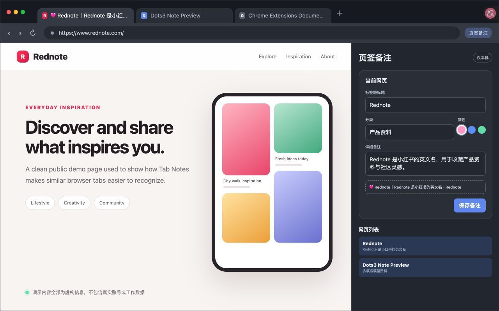
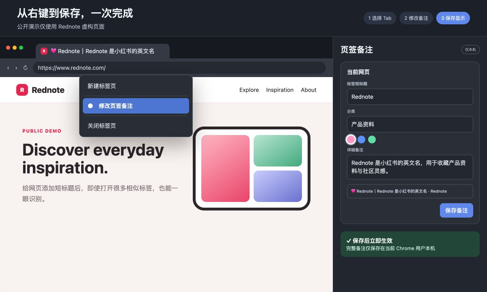
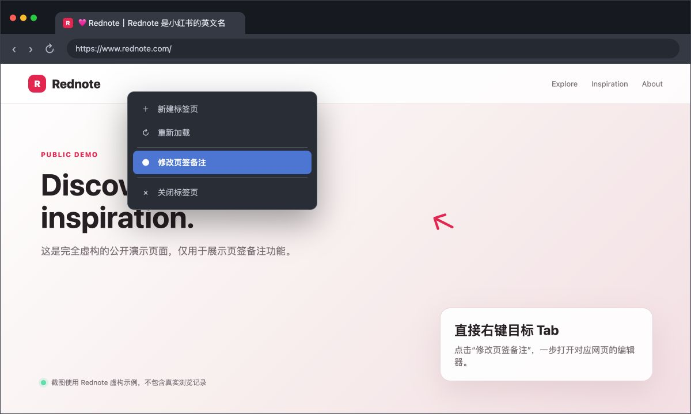

# 页签备注

> 给大量相似 Chrome 网页添加短标题、分类、颜色和详细备注。状态：v0.3.1；更新于 2026-08-17。

这是一个无服务器、无账号、无第三方依赖的 Chrome Manifest V3 扩展。所有备注只存放在当前 Chrome 用户的 `chrome.storage.local` 中，不会上传网络。

- GitHub：https://github.com/xmu-xiaoma666/tab-notes
- 下载最新版：https://github.com/xmu-xiaoma666/tab-notes/releases/latest



> 公开图片均为在 Chrome 中渲染的脱敏 PNG 截图，统一使用 Rednote 虚构示例；不包含真实账号、浏览记录、内部网址或工作数据。仓库不使用 SVG 宣传素材。

## 能做什么

- 将短标题和详细备注摘要放在原网页标题最前面，例如 `🩷 Rednote｜Rednote 是小红书的英文名 · Rednote`。
- 用颜色和分类区分实验、论文、文档、待办等网页。
- 在侧边栏搜索所有已打开网页，并一键切换。
- 保留已经关闭网页的备注，点击可重新打开。
- 按完整网址保存，带 `#` 的控制台路由也会分别记录。
- 可选地在网页右上角显示一张可折叠备注卡。
- 右键任意 Chrome 标签页，选择“修改页签备注”即可打开对应编辑器。
- 支持快捷键 `⌥⇧N`（Windows/Linux 为 `Alt+Shift+N`）打开侧边栏。

## 安装

### 下载发布版

1. 打开 https://github.com/xmu-xiaoma666/tab-notes/releases/latest 。
2. 下载最新的 `tab-notes-*.zip`，解压到本地文件夹。
3. 在 Chrome 地址栏打开 `chrome://extensions/`。
4. 打开右上角“开发者模式”。
5. 点击“加载已解压的扩展程序”，选择刚才解压的文件夹。

### 本地源码安装

1. 在 Chrome 地址栏打开 `chrome://extensions/`。
2. 打开右上角“开发者模式”。
3. 点击“加载已解压的扩展程序”。
4. 选择克隆后的 `tab-notes` 项目目录。
5. 建议把“页签备注”固定到工具栏；点击图标即可打开侧边栏。

更新代码后，在 `chrome://extensions/` 中点击本扩展的“重新加载”按钮即可。

## 快速使用



### 方式一：Tab 右键（推荐）

1. 在 Chrome 顶部或左侧标签栏中右键目标标签页。
2. 点击“修改页签备注”。
3. Chrome 会自动切换到该标签页并打开右侧备注栏。
4. 修改短标题、分类、颜色或详细备注，然后点击“保存备注”。



### 方式二：工具栏按钮

1. 先打开或选中要备注的网页。
2. 点击 Chrome 工具栏中的“页签备注”图标。
3. 在右侧备注栏完成编辑并保存。

如果图标没有显示，点击 Chrome 工具栏的拼图按钮，然后将“页签备注”固定到工具栏。

### 方式三：键盘快捷键

- macOS：`⌥ Option + ⇧ Shift + N`
- Windows / Linux：`Alt + Shift + N`
- 保存当前备注：macOS 使用 `⌘ Command + Enter`；Windows / Linux 使用 `Ctrl + Enter`

如果快捷键与其他扩展冲突，可以打开 `chrome://extensions/shortcuts`，找到“页签备注”并重新设置。

## 字段说明

- **标签短标题**：最先显示在 Tab 标题中，最多 24 个字符，例如“Rednote”。
- **分类**：用于区分实验、论文、文档和待办等页面，最多 16 个字符。
- **颜色**：会显示为 Tab 标题最前面的彩色圆点。
- **详细备注**：最多 2000 个字符；前 32 个字符会作为摘要显示在 Tab 标题中。
- **网页备注卡**：开启后，网页右上角会显示可折叠备注卡；关闭卡片只影响当前页面会话，不会删除备注。

标题显示示例：

```text
🩷 Rednote｜Rednote 是小红书的英文名 · Rednote
```

## 管理网页

- 侧边栏下半部分会列出当前所有已打开网页，有备注的网页排在前面。
- 可按短标题、分类、详细备注、网页标题或网址搜索。
- 点击列表项会切换到对应网页。
- 已关闭但保存过备注的网页会显示在“已保存但未打开”，点击可重新打开。
- 删除备注：选中网页，在编辑区域点击“删除”。删除后网页标题会恢复为原标题。
- 切换标签页时，右侧编辑器会自动更新为当前网页的备注。

## 用 Dots3 Note Preview 继续 Vibe Coding

如果你也想把日常工作中的小痛点快速做成浏览器插件、脚本或个人工具，可以试试 **Dots3 Note Preview**。

Dots3 Note Preview 是 dots3 系列首个开放权重模型，采用多模态 MoE 架构，共 280B 参数、每次激活 16B 参数，支持最高 512K 上下文；输入覆盖文本、图片、视频和音频，并支持代码生成、工具调用、多步 Agent 与长上下文任务。它很适合用来读需求、看界面截图、讨论交互方案，再配合你熟悉的编码工具继续 Vibe Coding。

- 中文介绍：https://studio.dots.ai/dots/dots3-zh.html
- English：https://studio.dots.ai/dots/dots3-en.html
- Hugging Face：https://huggingface.co/dots-studio/dots3-note-prev
- GitHub：https://github.com/studio-dots-ai/dots3-note-prev
- API 服务（国内）：https://dots.ai/platform/

以上模型参数与能力描述来自 Dots3 Note Preview 官方 GitHub README；“适合用于 Vibe Coding”是本项目的使用建议。

## 更新扩展

本地代码更新后：

1. 打开 `chrome://extensions/`。
2. 找到“页签备注”，点击圆形“重新加载”按钮。
3. 如果是从 v0.1.x 升级到 v0.2.0 或更高版本，将已有备注的旧页面刷新一次。

## 常见问题

### 保存后 Tab 标题没有变化

1. 在 `chrome://extensions/` 确认扩展版本与本目录 `manifest.json` 一致。
2. 点击扩展的“重新加载”。
3. 刷新目标网页，再保存一次备注。

### 右键菜单中没有“修改页签备注”

重新加载扩展，然后重新打开一次 Chrome 的 Tab 右键菜单。该菜单只出现在标签页的右键菜单中，不出现在网页正文右键菜单中。

### 详细备注没有显示

Tab 标题只显示详细备注的前 32 个字符，完整内容可在侧边栏或网页备注卡中查看。若仍只显示短标题，说明 Chrome 可能仍在运行旧版扩展，请按“更新扩展”操作。

### 哪些页面不支持修改标题

Chrome 自身页面（例如 `chrome://settings`）不允许扩展修改标题或注入备注卡，但仍可以在侧边栏保存备注。

v0.1.1 起，安装扩展之前已经打开的普通网页也会在保存后自动注入标题备注，无需刷新网页。

v0.2.0 增加跨扩展重载的实例清理机制，并会清除历史重复前缀，避免多个标题监听器互相触发。由 v0.1.x 升级到 v0.2.0 后，需要将已经加过备注的旧页面刷新一次，以清除旧版本遗留的监听器；之后再次重载扩展无需刷新网页。

v0.2.1 会在标签标题中同时显示详细备注的前 32 个字符；如果没有填写短标题或分类，则直接使用详细备注作为标签前缀。
为避免和标题分隔符冲突，短标题或备注摘要中的 `·`、`|`、`｜` 会在标签标题中显示为 `•`，原始备注内容不会被修改。

v0.3.0 增加 Chrome Tab 右键菜单“修改页签备注”。点击后会激活对应标签页并打开备注侧栏。

v0.3.1 优化大量标签页下的编辑速度：保存时只刷新当前网址对应的标签，侧边栏复用已加载的标签数据并合并重复渲染，不再每次修改都重新扫描和重绘全部状态。

## 本地检查

```bash
node --check background.js
node --check content.js
node --check sidepanel.js
node tests/shared.test.js
node tests/background.test.js
```
